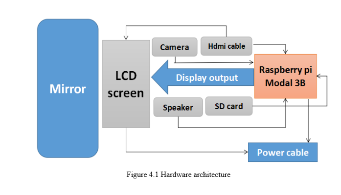
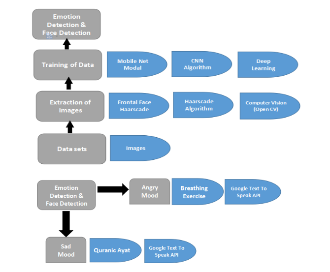
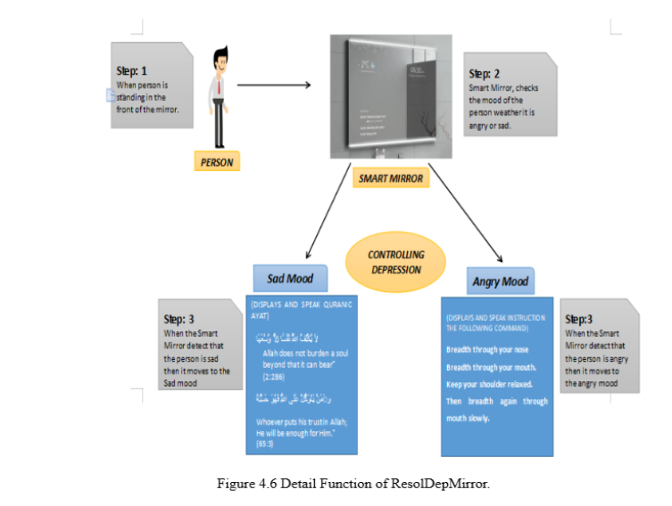
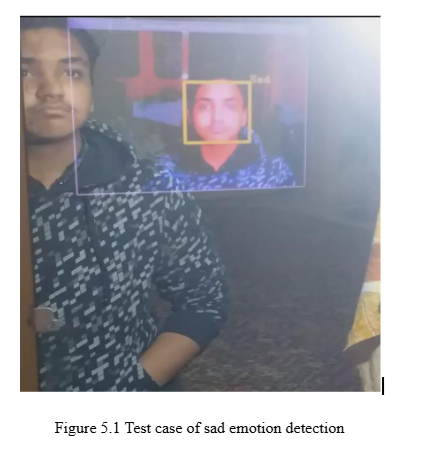
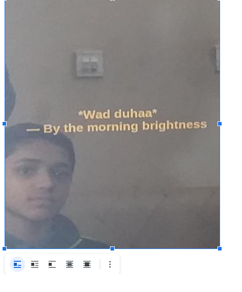

# 📖 Proposed Smart Mirror – ResolDepMirror

## 🏗️ **Hardware Architecture**  
The hardware design of **ResolDepMirror** includes:

- **Two-way Mirror**
- **LCD Screen**
- **Camera (Raspberry Pi)**
- **Speaker**

### 🖼 **Mirror and LCD Screen**  
- The **two-way mirror** provides both transparency and reflectiveness, allowing a digital interface while hiding the underlying hardware.
- The **LCD screen** is enclosed inside a wooden box for a seamless appearance.  

### **Raspberry Pi**  
The **Raspberry Pi Model 3B** is used, featuring:  
✔️ **64-bit Quad-Core ARM Cortex-A1 Processor**  
✔️ **40 GPIO Pins**  
✔️ **SD Card Slot** (used as a hard disk)  
✔️ **USB, Ethernet, Wi-Fi, HDMI**, and **Camera Serial Interface**

### **Speaker & Camera**  
- **Camera**: 12MP camera for emotion detection  
- **Speaker**: Plays Quranic verses and guides breathing exercises  

### **Other Components**  
- **SD Card**: **32GB** (stores OpenCV, TensorFlow, and OS)  
- **HDMI Cable**: Connects Raspberry Pi to LCD  
- **Power Cable**: **5V USB Charger**  

---

## 💻 **Software Architecture**  
The software uses **computer vision (OpenCV)** and **deep learning** techniques to train emotion recognition models.  

### 🖼 **Software Architecture**  

### **Dataset**  
- **Primary Data**: 270 facial expression images (Happy, Sad, Angry)  
- **Secondary Data**: Kaggle dataset  

### **Image Processing & Model Training**  
- **Haar Cascade Classifier**: Detects facial features (eyes, nose, mouth)  
- **MobileNet Model**: Lightweight deep learning model for training datasets (Accuracy: **70.9% - 89.9%**)  

### **Real-Time Emotion Detection**  
- **Sad Mood** ➝ Displays and reads aloud **Quranic verses**  
- **Angry Mood** ➝ Displays **breathing exercises**  

---

## ⚙️ **Functionality of ResolDepMirror**  

### **Sad Mood Module**  
✔️ Uses **Cognitive Behavioral Therapy (CBT)** principles  
✔️ Displays motivational **Quranic verses** using **Tkinter (GUI)**  
✔️ Speaks the verse using **Google Text-To-Speech (gTTs API)**  

### **Angry Mood Module**  
✔️ Guides **breathing exercises** through text and voice  

🖼 **ResolDepMirror Functionality**  

---

## **Test Cases**  
-   
-   

---

## 📌 **Summary**  
- **Hardware**: Mirror, LCD, Raspberry Pi, Camera, Speaker  
- **Software**: OpenCV, Deep Learning (**MobileNet**), Emotion Detection  
- **Functionality**: Identifies **sad/angry moods**, responds with **Quranic verses** or **relaxation exercises**

---

## 📜 **Citations**  
- **WHO Depression Report**: **322 million people affected by depression**  
- **Kaggle Facial Expression Dataset**  
- **MobileNet Deep Learning Model**
